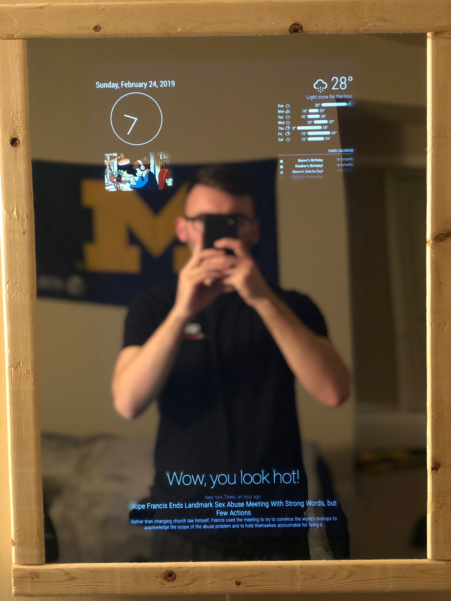
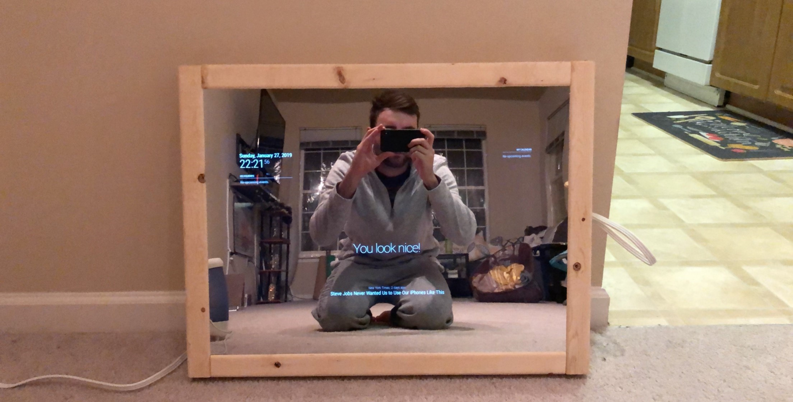

# SmartMirror
Smart Mirror is a mirror that will display text, videos, or anything a computer monitor can display, behind a working two-way mirror.




## Background

A build off the "Magic Mirror" base. A smart mirror that will display a web page, and eventually new additional modules.

The base "Magic Mirror" project can be found <a href="https://github.com/MichMich/MagicMirror">here</a>.

The SmartMirror project builds MichMich's entire MagicMirror project, then adds a small SmartMirror folder in the MagicMirror directory.

This is done through the SmartMirror.sh file, pulling MichMich's project, pulling the DanCout project, and then (for now) overwriting the config.js file.

## Automatic Install & Start
(Under Construction)

To start this project for yourself on a linux machine, open the terminal and enter 
```bash
bash -c "$(curl -sL https://raw.githubusercontent.com/DanCout/SmartMirror/master/SmartMirror.sh)"
```


## Manual Installation

Please install the [MagicMirror project](https://github.com/michmich/magicmirror) by running the following command:
```bash
bash -c "$(curl -sL https://raw.githubusercontent.com/MichMich/MagicMirror/master/installers/raspberry.sh)"
```

This project uses the following 3rd party modules:
* [MMM-awesome-alexa](https://github.com/dolanmiu/MMM-awesome-alexa)
* [MMM-forecast-io](https://github.com/dmcinnes/MMM-forecast-io)
* [MMM-SmartWebDisplay](https://github.com/AgP42/MMM-SmartWebDisplay)
* [MMM-Remote-Control](https://github.com/Jopyth/MMM-Remote-Control)
* [MMM-AlexaOnOff](https://github.com/shbatm/MMM-AlexaOnOff)

Please install each of these modules in the MagicMirror/modules directory.
Once installed, you will need to manaully enter any API keys (currently for MMM-forecast-io & MMM-awesome-alexa).

## Coming Soon
* Frame Construction Tutorial
* Config API info loader module